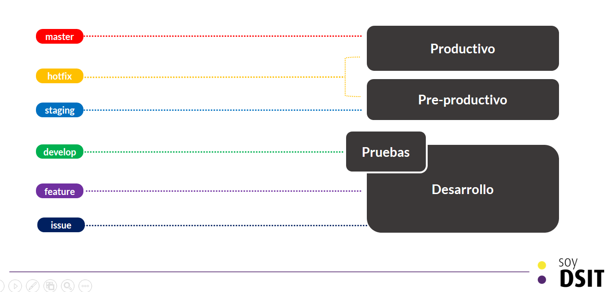

# Manejo de ambientes
En este capítulo se explica el manejo de las ambientes para el desarrollo, pruebas y despliegue de aplicaciones de la Dirección de Servicios de Información y Tecnologías DSIT de la Universidad de Los Andes.

## Ambientes
Los ambientes definidos para el desarrollo de aplicaciones son:

1. desarrollo
2. pruebas
3. pre-productivo o staging
4. productivo

### 1. Desarrollo
Este ambiente es local para los desarrolladores, donde cada uno puede trabajar de forma independiente, teniendo como punto de encuentro únicamente las ramas. No se cuenta con ambiente de desarrollos compartidos para evitar errores en el código y conflictos con bases de datos. Este ambiente tiene las siguientes reglas:
  * El ambiente debe manejar las mismas versiones de herramientas, lenguajes, frameworks y bases de datos que los ambientes productivos.

### 2. Pruebas
Este ambiente es homólogo a nivel de configuración del ambiente productivo. Está destinado para pruebas únicamente las cuales son realizadas por el tester del proyecto. Las reglas de este ambiente son:
  * El ambiente debe cumplir con una configuración identica al productivo, es decir a nivel de sistema operativo, servidor, permisos, roles, puertos, variables de ambiente, etc.
  * El ambiente puede diferir en cuanto a algunas características de la arquitectura (replicación, autoescalamiento) pero no en sus componentes (servicios, cache, colas de tareas, etc).
  * El equipo de pruebas es responsable de mantener este ambiente estable

### 3. Pre-productivo
Este ambiente es homólogo a todo nivel con el ambiente productivo. Está destinado para realizar pruebas de aceptación con el líder funcional y el usuario final. Las reglas de este ambiente son:
  * El ambiente debe cumplir con una configuración identica al productivo, es decir a nivel de sistema operativo, servidor, permisos, roles, puertos, variables de ambiente, etc.
  * El ambiente no debe diferir en cuanto a arquitectura ni componentes frente al ambiente productivo.
  * El equipo de operaciones es responsable de mantener este ambiente estable

### 4. Productivo
Este ambiente es el de producción de la aplicación. Las reglas de este ambiente son:
  * Siempre debe tener una versión estable de la aplicación en ejecución  
  * El equipo de operaciones es responsable de mantener este ambiente estable
  * El equipo de operaciones son lo únicos que pueden desplegar una versión anterior de la aplicación si se considera necesario

## Ramas y Ambientes
La correspondencia entre ambientes y ramas es la siguiente:

| Ambiente      | Ramas permitidas |
| ------------- |:----------------:|
| Desarrollo    | Issues, Features, develop |
| Pruebas       | Develop (usando las versión del pull request )|
| Staging       | Staging, Hotfix (si se ve necesario)|
| Productivo    | Master|

Es responsabilidad del equipo en su totalidad el correcto uso de los ambientes y las ramas asociadas a cada uno.

Para más información de las ramas consulte [aquí](./BRANCHES.md)
