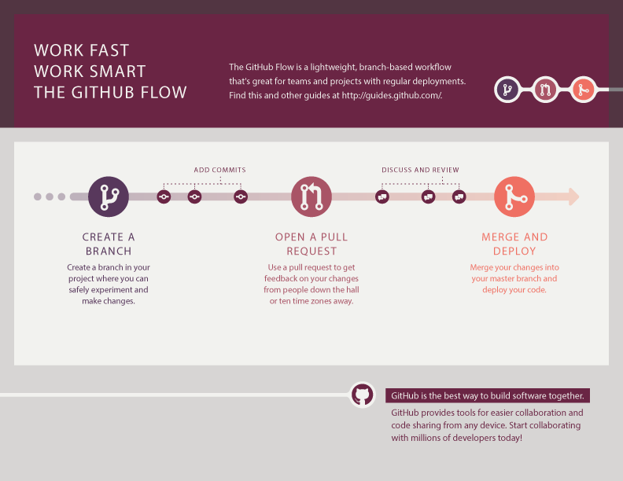

# ¿Cómo Puedo Contribuir?

> Tomados parcialmente de [Contributing to Atom](https://github.com/atom/atom/blob/master/CONTRIBUTING.md)

## Pull Requests

Todo cambio entre ramas debe seguir el manejo de pull requests como se indica en la sección de Ramas. Tenga presente las siguientes recomendaciones en el momento de crear un pull request.

* Llene [la plantilla requerida](./PULL_REQUEST_TEMPLATE.md)
* No incluya números de issues en el título del PR
* Incluya screenshots y GIFs animados en su pull request cuando sea posible.
* Siga las guías de estilo.
* Incluya todos los tests necesarios.
* Documente código nuevo basado en la [Guía de Estilo de Documentación](../style/COMMITS_DOCUMENTATION.md)
* Termine todos los archivos con un newline.

## Sugiriendo Mejoras

Esta seccion lo guiara para el envio de sugerencias de mejoras, incluyendo características completamente nuevas y mejoras menores a la funcionalidad existente. Seguir estas pautas ayuda a los desarrolladores y a la comunidad a entender su sugerencia :pencil: y a encontrar sugerencias relacionadas :mag_right:.

Antes de crear sugerencias de mejora, por favor consulte [esta lista](#antes-de-enviar-una-sugerencia-de-mejora) ya que puede descubrir que no necesita crear una. Cuando usted esta creando una Sugerencia de Mejora, por favor [incluya la mayoría de detalles posibles](#cómo-presento-una-buena-sugerencia-de-mejora). complete [la plantilla](ISSUE_TEMPLATE.md), incluya los pasos que ud tomaria si la caracteristica que usted esta solicitando existiera.

#### Antes de Enviar una Sugerencia de Mejora

* **Revise si existe una herramienta que brinde esa mejora.**
* **Determine en cuál proyecto o proyectos se impacta esta mejora.**
* **Realizar una [busqueda superficial](https://github.com/search?q=+is%3Aissue+user%3Auniandesdsit)** para ver si la mejora ha sido sugerida. Si es asi, agregue un comentario al problema existente en lugar de abrir uno nuevo.

#### ¿Cómo Presento una (Buena) Sugerencia de Mejora?

Las sugerencias de mejoras se rastrean como [GitHub issues](https://guides.github.com/features/issues/). Despues de que usted determine cuál repositorio está relacionado con su sugerencia de mejora, cree un issue en el repositorio y provea la siguiente información:

* **Use un titulo claro y descriptivo** para el issue para identificar la sugerencia.
* **Provea una descripcion paso a paso de la sugerencia de mejora** tan detallada como sea posible.
* **De ejemplos especificos para demostrar cada paso**. incluya ejemplos completos y claros, como [Markdown code blocks](https://help.github.com/articles/markdown-basics/#multiple-lines).
* **Describa el comportamiento actual** y **explique que comportamiento espera ver en su lugar** y por qué.
* **Incluya pantallazos y GIFs animados** que le ayuden a demostrar los pasos o señale la parte a la que se refiere la sugerencia. Usted puede usar [esta herramienta](https://www.cockos.com/licecap/) para grabar GIFs en macOS y Windows, y [esta herramienta](https://github.com/colinkeenan/silentcast) o [esta](https://github.com/GNOME/byzanz) en Linux.
* **Explique porque esta mejora debería usarse** para la mayoría de los usuarios y no es algo que pueda o deba implementarse como un módulo específico.
* **Enumere algunas aplicaciones o soluciones donde esta mejora existe.**
* **Especifique que version del proyecto está utilizando.** Usted puede conocer la version exacta revisando la documentación de API, la de la aplicación en cuestión en su Acerca de, o a través de la tienda de aplicaciones.
* **Especifique el nombre y version de Sistema Operativo que está utilizando**, si es aplicación de escritorio o móvil.
* **Especifique el nombre y version del navegador que está utilizando**, si es aplicación web.

## Reportando Bugs

Esta seccion lo guia a traves del envio de errores. Seguir estas guias lo ayudan a que los desarrolladores y la comunidad entiendan su reporte :pencil:, reproduzca el comportamiento :computer: :computer:, y encuentre informes relacionados :mag_right:.

Antes de crear un reporte de bugs, por favor revise [esta lista](#antes-de-sugerir-un-informe-de-error) como puede descubrir que no necesita uno. Cuando usted esta creando un reporte de bugs, por favor [incluya tantos detalles como sea posible](#cómo-presentar-un-buen-informe-de-error). Complete [plantilla requerida](ISSUE_TEMPLATE.md), la informacion que esta pregunta ayuda a resolver los issues rapido.

> **Nota:** Si usted encuentra un issue con estado **Closed** que es igual al mismo que usted esta experimentando, abra un nuevo issue e incluya in link al issue original en el cuerpo de su nuevo issue.

#### Antes de sugerir un informe de error

* **Determine en qué repositorio debe informarse el problema**.
* **Realice una [busqueda general](https://github.com/search?q=+is%3Aissue+user%3Auniandesdsit)** para ver si el problema ya ha sido reportado. Si lo ha sido **y el issue aún está abierto**, agregue un comentario al issue existente en lugar de abrir uno nuevo.

#### ¿Cómo Presentar un (Buen) Informe de Error?

Los errores se registran y siguen como [GitHub issues](https://guides.github.com/features/issues/). Después de haber determinado en cuál repositorio está relacionado tu error, crea un issue en ese repositorio y provee la siguiente información llenando [esta plantilla](ISSUE_TEMPLATE.md).

Explica el problema e incluye todos los detalles e información adicional necesarios para ayudar a los desarrolladores a entender y reproducir el problema:

* **Usa un titulo descriptivo y claro** para identificar el problema del issue.
* **Describe los pasos exactos para reproducir el issue** dando la mayor cantidad de detalles posible. Por ejemplo, empieza explicando cómo entraste al sitio, aplicación o API. Cuando listes los pasos, **no sólo digas qué hiciste sino cómo lo hiciste**. Por ejemplo, si navegaste hacia el final de la página, explica si utilizaste el mouse, o un atajo de teclado o un comando del navegador, y si fue así, cuál usaste.
* **Provee ejemplos específicos para demostrar estos pasos**. Incluye links a archivos o proyectos de GitHub, o usa trozos copiables/pegables de código (snippets), que usaste en estos ejemplos. Si provees snippets, usa [Markdown code blocks](https://help.github.com/articles/markdown-basics/#multiple-lines).
* **Describe el comportamiento observado después de seguir estos pasos** y resalta cuál es el problema exactamente con ese comportamiento.
* **Explica qué comportamiento debió haber ocurrido y por qué.**
* **Incluye pantallazos y GIFs animados** que le ayuden a demostrar los pasos o señale la parte a la que se refiere la sugerencia. Usted puede usar [esta herramienta](https://www.cockos.com/licecap/) para grabar GIFs en macOS y Windows, y [esta herramienta](https://github.com/colinkeenan/silentcast) o [esta](https://github.com/GNOME/byzanz) en Linux.
* **Si estás reportando que una aplicación se cerró inesperadamente**, incluye un reporte de fallos. En el caso de aplicaciones Android y iOS, puedes conectarte a una máquina que tenga herramientas de desarrollo como adb y recoger así la salida del error.
* **Si el problema no fue causado por una acción específica**, describe qué estabas haciendo antes de que ocurriera y comparte información relacionada usando la lista que se encuentra abajo.

Provee más información del contexto respondiendo a las siguientes preguntas:

* **Empezó a ocurrir el problema recientemente** (ej. después de realizar una actualización) o fue siempre un problema?
* Si el problema empezó a ocurrir recientemente, **puedes reproducir el problema en una versión más antigua?** Cuál es la versión más reciente en la que este problema empieza a ocurrir?
* **Puedes reproducir este error con certeza?** Si no, provee detalles sobre qué tan frecuentemente ocurre y bajo qué condiciones ocurre normalmente.

Incluye detalles acerca del entorno:

* **Especifique que version del proyecto está utilizando.** Usted puede conocer la version exacta revisando la documentación de API, la de la aplicación en cuestión en su Acerca de, o a través de la tienda de aplicaciones.
* **Especifique el nombre y version de Sistema Operativo que está utilizando**, si es aplicación de escritorio o móvil.
* **Especifique el nombre y version del navegador que está utilizando**, si es aplicación web.
